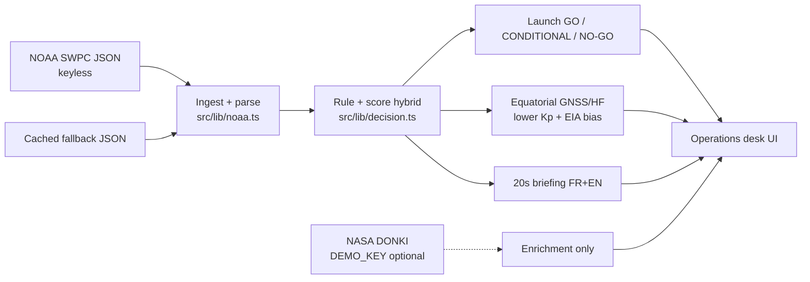

# HelioClear

Space-weather operations desk for **Balbino Tchoutzine** (ENSPY Yaoundé).  
IBM AI Builders Challenge — August 2026 — theme **Advance Space Exploration with AI**.

Live NOAA SWPC JSON (no API key) → **GO / CONDITIONAL / NO-GO** for (1) launch and (2) equatorial GNSS/HF over Cameroon and the Gulf of Guinea, plus a 20-second FR+EN briefing and why-bullets.

Educational prototype, **not certified**. Not a copy of the NASA Jupyter space-weather lab.

## Problem

Launch windows and equatorial radio/GNSS service still drown in raw space-weather feeds. Kp, GOES X-ray class, solar wind, IMF Bz, and NOAA R/S/G scales are public, but they are not a single operator call. Cameroon sits near the magnetic equator: the equatorial ionization anomaly and post-sunset scintillation hit GNSS and HF harder than a mid-latitude launch desk would assume.

Operators need a readable go/no-go with reasons, in French and English, without an API key.

## Solution

HelioClear is a Next.js operations desk that:

- Pulls keyless NOAA SWPC JSON (Kp now / 24h / 72h forecast, GOES flares, solar wind speed, IMF Bz, NOAA scales, alerts)
- Scores two missions with an interpretable rule+score hybrid
- Applies hard overrides for S3+ radiation, G4+ geomagnetic storms, and X5+ flares
- Adds a lower GNSS Kp trigger and an EIA / post-sunset bias for Cameroon
- Speaks a ~20-second briefing in FR or EN
- Falls back to a cached snapshot if NOAA is down, **labelled in the UI**
- Optionally enriches with NASA DONKI using `DEMO_KEY` only — DONKI never blocks a call

Demo fixtures: `live`, `sample`, `quiet`, `equatorial` (Launch **GO** / GNSS **CONDITIONAL**), `storm` (both **NO-GO**), `xflare`, `radiation`.

## AI approach

This is **interpretable decision support**, not a black-box model. Additive points from physical drivers, then hard safety overrides. Every point shows up as a why-bullet. Fixtures lock the engine in Vitest so a judge can replay the same calls.



## Challenge theme

**Advance Space Exploration with AI** — turn data-heavy heliophysics feeds into a mission call an operator can read in 20 seconds.

## How IBM Bob was used

Honest status for the August 2026 submission:

This public repo was **scaffolded for the challenge** so there is a working prototype, README, tests, and Vercel-ready app on GitHub. **IBM Bob was not the primary author of this first implementation.** Treating it as such would be dishonest.

Balbino will:

1. Complete the required IBM SkillsBuild IBM Bob lab
2. Open the project in the IBM Bob IDE
3. Iterate with the checklist **plan → implement → test → explain** (see empty template in [`BOB.md`](./BOB.md))

## Quick start

```bash
npm install
npm test
npm run dev
```

App: [http://localhost:43147](http://localhost:43147) (also [http://127.0.0.1:43147](http://127.0.0.1:43147)).

```bash
npm run build
```

No secrets required. Optional NASA key:

```bash
cp .env.example .env.local
# NASA_API_KEY=DEMO_KEY
```

## Decision engine

`src/lib/decision.ts`

| Driver | Role |
| --- | --- |
| Kp now / 24h / 72h | Additive; GNSS trigger is lower than launch |
| GOES flare rank | A/B/C/M/X magnitude → points; **X5+ → NO-GO** |
| Solar wind speed | Points above ~500 km/s |
| IMF Bz | Points when southward beyond −3 nT |
| NOAA R / S / G | Additive; **S3+ and G4+ → NO-GO** |
| Equatorial EIA | GNSS-only post-sunset bias for Cameroon / Gulf of Guinea |

Bands: GO `< 35`, CONDITIONAL `35–69`, NO-GO `≥ 70` or any hard override.

## NOAA endpoints (keyless)

- `https://services.swpc.noaa.gov/json/planetary_k_index_1m.json`
- `https://services.swpc.noaa.gov/products/noaa-planetary-k-index.json`
- `https://services.swpc.noaa.gov/products/noaa-planetary-k-index-forecast.json`
- `https://services.swpc.noaa.gov/json/goes/primary/xray-flares-latest.json`
- `https://services.swpc.noaa.gov/products/summary/solar-wind-speed.json`
- `https://services.swpc.noaa.gov/products/summary/solar-wind-mag-field.json`
- `https://services.swpc.noaa.gov/products/noaa-scales.json`
- `https://services.swpc.noaa.gov/products/alerts.json`

## Stack

Next.js App Router, TypeScript, Tailwind CSS, three.js / React Three Fiber (SUVI sun + NASA Blue Marble earth), Vitest. Vercel-ready.

## License

MIT © 2026 Balbino Tchoutzine
